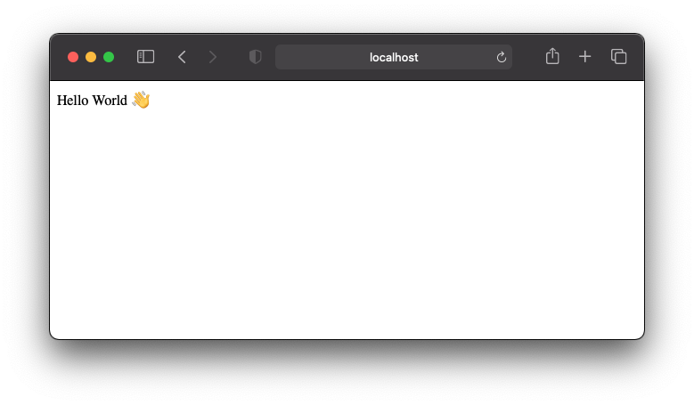

# Expressjs + Typescript + Live reloading

A minimal [Express.js](https://expressjs.com/) server in [Typescript](https://www.typescriptlang.org/) with _Live Reloading_. Ready to be hosted on [heroku](https://www.heroku.com/).

## Get Started

```console
npm install
npm run dev
```

Server is ready at http://localhost:3000.

Edit `src/index.ts`, save file, server restarts automatically, refresh your browser to see the changes.



## Static files

Files in the `public/` folder are served statically, see http://localhost:3000/cover.jpg.

## Environment variables

Create a `.env` file:

```
PORT=3000
STRIPE_PRIVATE_KEY=blablabla
```

Env vars are available in your app, eg. `process.env.STRIPE_PRIVATE_KEY`.

It is good practice to:

- _not_ commit your `.env` file
- keep `.env.example` updated with empty value for sensitive key

## Scripts in a nutshell

Scripts in `package.json` :

- `npm run dev` runs the server and automatically restart the server when a change is made in `src` folder.
- `npm run build` generates `.js` files from `*.ts` files.
- `npm run start` runs the node server from the generated `index.js`.

## Deploy

This minimal project can be hosted on any platform that runs nodejs apps, such [heroku](heroku.com), [digital ocean](https://digitalocean.com/), [deta](http://deta.sh/), etc.

Has been successfully deployed on heroku, see: https://expressjs-with-typescript.herokuapp.com/
